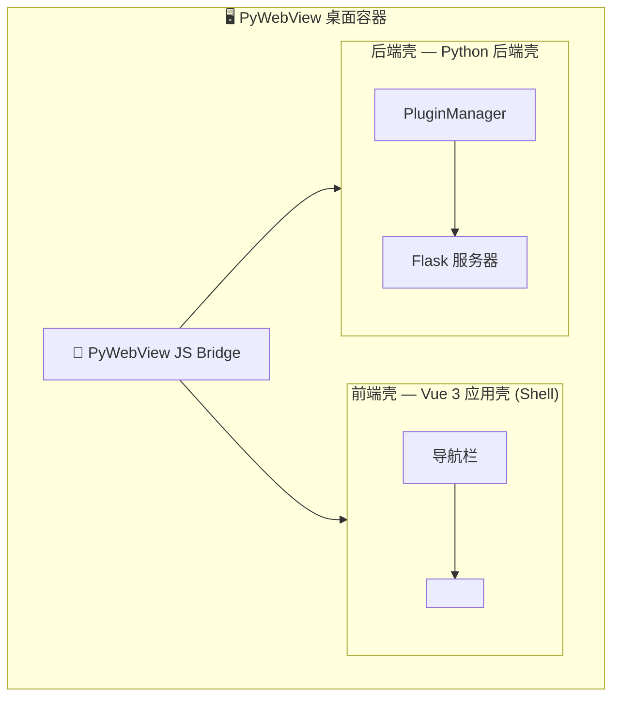

# OmniBox

**OmniBox** 是一个轻量级、可扩展的桌面应用框架。它本身不包含任何业务功能，所有能力均由可插拔的插件提供。你可以像安装浏览器扩展一样，自由添加、移除功能模块。

---

## ✨ 特性

- **极简核心**：主程序仅提供窗口容器、插件管理和安全沙箱，体积小巧。
- **完全解耦**：插件与主程序独立开发、独立构建，技术栈自由（前端可用 Vue、React 或纯 HTML）。
- **热插拔**：将插件文件夹放入 `plugins/` 目录即可启用，删除即卸载，无需重启或重新构建。
- **安全隔离**：插件运行在独立 iframe 中，后端 API 通过命名空间隔离，权限可声明。
- **易于分发**：主程序打包为单个可执行文件，插件可离线安装或通过内置商店获取（规划中）。
- **跨平台**：基于 PyWebView，后续可支持 Windows、macOS、Linux。
- **统一外观**：内置浅色/深色主题切换，支持自定义 CSS 变量级颜色配置，全插件自动同步。
- **通用布局**：统一的工具栏、侧边栏、内容区样式（`.view-toolbar`、`.view-sub-sidebar` 等），插件无需重复定义。

---

## 🏗️ 架构概览



- **前端壳**：Vue 3 + Vue Router，动态加载插件清单并生成导航和 iframe 路由。
- **后端壳**：Python 插件管理器，负责插件的发现、依赖解析、加载和 API 聚合。
- **通信**：所有页面同源（`http://127.0.0.1`），插件前端可直接调用 `parent.pywebview.api` 访问后端方法。
- **插件**：每个插件是一个独立文件夹，包含 `manifest.json`、`backend/`（Python 代码）和 `frontend/`（静态网页资源）。

### 插件通用布局

Shell 在 `base.css` 中统一注入以下布局类，**所有插件应直接使用，无需在自己的 CSS 中重复定义**：

| CSS 类 | 用途 |
|--------|------|
| `.view-body` | 主内容区容器（flex 列，自动伸缩） |
| `.view-toolbar` | 顶部工具栏（48px，统一背景/边框） |
| `.toolbar-group` | 工具栏内的按钮组（flex 行，8px 间距） |
| `.view-sub-sidebar` | 左侧子侧边栏（240px） |
| `.sub-sidebar-header` | 侧边栏标题行 |
| `.sub-sidebar-footer` | 侧边栏底部统计区 |
| `.view-content` | 内容滚动区（flex: 1，自动 overflow） |

### 外观主题

- 通过 `document.documentElement` 上的 `data-theme="dark"` / `data-theme="light"` 属性切换主题。
- 设置页提供 🎨 **外观设置面板**：浅色/深色切换 + 14 项 CSS 变量颜色自定义（下拉框选择预设色）。
- 自定义颜色通过 `data-custom-colors` 属性 **自动同步到所有插件 iframe**，插件前端的 CSS 变量实时更新。

### 全屏联动

视频播放器等需要全屏的插件可通过设置 `parent.document.documentElement` 的 `data-video-fullscreen` 属性隐藏导航栏，Shell 端通过 MutationObserver 监听并自动处理。

---

## 🚀 快速开始

### 环境要求

- Python 3.10+
- Node.js 18+
- npm 9+
- PowerShell 5.1+ (Windows) 或兼容终端

### 一键安装与运行（推荐）

项目提供了 `deploy.ps1` 脚本，可自动完成虚拟环境创建、Python 依赖安装以及前端壳的构建。

```powershell
# 克隆仓库
git clone https://github.com/Flotiarenor/OmniBox.git
cd OmniBox

# 运行一键部署脚本
.\deploy.ps1
```

首次启动后，你将看到一个空白的窗口，左侧导航栏仅显示 “OmniBox”。接下来安装插件。

### 安装插件

1. 将插件文件夹放入项目根目录下的 `plugins/` 目录。
2. 重启应用，插件将自动出现在导航栏中。

## 🧩 插件开发

完整的插件开发指南请参阅 [插件开发文档](./docs/plugin-guide.md)。
该文档包含插件结构、`manifest.json` 规范、后端与前端开发示例、调试技巧以及最佳实践。

---

## 📦 打包发布

使用 PyInstaller 将主程序打包为独立可执行文件：
.\docs\Releases下内置build-release.ps1和配置文件omnibox.spec,虚拟环境下运行ps1文件即可完成打包编译操作

## 📄 许可证

本项目基于 **Apache License 2.0** 开源。详见 [LICENSE](./LICENSE) 文件。

```
Copyright 2025 OmniBox Contributors

Licensed under the Apache License, Version 2.0 (the "License");
you may not use this file except in compliance with the License.
You may obtain a copy of the License at

 http://www.apache.org/licenses/LICENSE-2.0

Unless required by applicable law or agreed to in writing, software
distributed under the License is distributed on an "AS IS" BASIS,
WITHOUT WARRANTIES OR CONDITIONS OF ANY KIND, either express or implied.
See the License for the specific language governing permissions and
limitations under the License.
```

---

## 🤝 贡献

欢迎提交 Issue 和 Pull Request！请确保遵循项目的代码规范，并通过现有测试。

---

## 📧 联系方式

- 项目主页：[https://github.com/Flotiarenor/OmniBox](https://github.com/Flotiarenor/OmniBox)
- 问题反馈：[Issues](https://github.com/Flotiarenor/OmniBox/issues)
