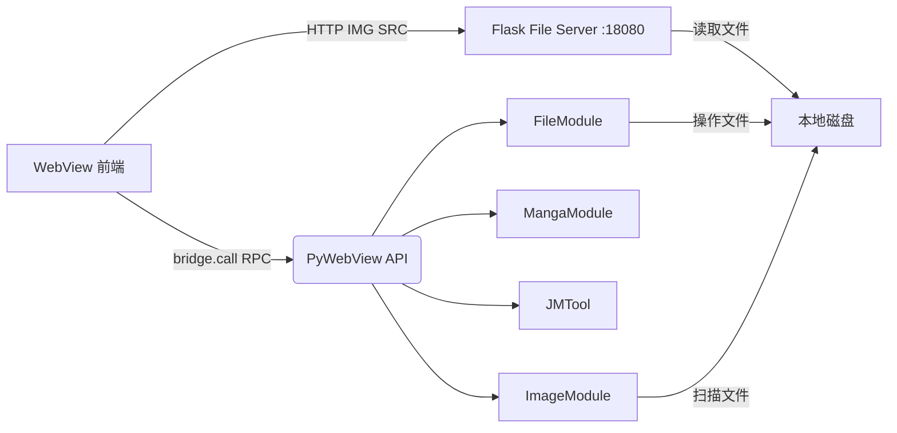

## 🤖 Assistant

# 个人数字中心 - 架构与开发文档

> 一个基于 PyWebView + 原生 JavaScript 构建的本地多媒体管理应用，集图片浏览、漫画库管理与阅读、在线漫画下载于一体。采用极简解耦设计，后端 Python 负责核心逻辑与文件操作，前端负责交互与展示。

---

## 📖 目录

- [核心特性](#-核心特性)
- [系统架构设计](#-系统架构设计)
- [目录结构](#-目录结构)
- [前端核心模块说明](#-前端核心模块说明)
 - [ImageViewer (图片浏览器)](#1-imageviewer-图片浏览器)
 - [MangaLibrary (漫画库)](#2-mangalibrary-漫画库)
 - [MangaReader (沉浸式阅读器)](#3-mangareader-沉浸式阅读器)
- [后端核心模块说明](#-后端核心模块说明)
 - [FileModule (文件系统安全网关)](#1-filemodule-文件系统安全网关)
 - [ImageModule (图片扫描与缓存引擎)](#2-imagemodule-图片扫描与缓存引擎)
 - [MangaModule (漫画元数据与状态管理)](#3-mangamodule-漫画元数据与状态管理)
 - [JMTool (下载与元数据抓取适配器)](#4-jmtool-下载与元数据抓取适配器)
- [数据流转与通信机制](#-数据流转与通信机制)
- [数据持久化方案](#-数据持久化方案)
- [部署与运行](#-部署与运行)

---

## 🌟 核心特性

- **Justified Layout 瀑布流**：仿 Google Photos 的自适应行高排版，基于图片真实宽高比动态计算，无裁切展示。
- **极简 RPC 通信**：前端通过统一的 `bridge.call()` 调用后端方法，无需关心 HTTP 请求细节。
- **路径安全沙箱**：后端所有文件操作强制校验路径前缀，杜绝路径穿越攻击（`../`）。
- **多级视图状态机**：漫画库采用 `home -> chapters -> images` 视图栈管理，支持无限层级返回。
- **元数据驱动**：漫画信息完全依赖本地 `album_info.json`，离线可用，无需联网即可浏览详情。

---

## 🏗 系统架构设计

应用采用 **C/S 双进程混合架构**：

1. **PyWebView 宿主进程**：运行 Python 后端代码，暴露 `AppAPI` 实例给前端。
2. **Flask 文件服务器**：独立线程运行在 `127.0.0.1:18080`，专门负责静态资源（图片、缩略图、封面）的高速分发。
3. **WebView 渲染进程**：加载前端 HTML/JS，通过 `window.pywebview.api` 进行同步/异步 RPC 调用。



**为什么图片不走 RPC 传输？**
通过 Flask 提供标准 HTTP 图片链接，前端可直接使用 `` 和浏览器原生的缓存、懒加载（`loading="lazy"`）机制，性能远超 Base64 编码的 RPC 传输。

---

## 📁 目录结构

```text
项目根目录/
├── main.py                     # 应用入口，初始化 PyWebView 与 Flask
├── backend/
│   ├── api.py                  # RPC 接口层，聚合各 Module
│   ├── file_server.py          # Flask 静态文件服务器
│   └── modules/
│       ├── file_module.py      # 文件操作（移动/删除/目录树）
│       ├── image_module.py     # 图片扫描与尺寸缓存
│       ├── manga_module.py     # 漫画库逻辑与状态管理
│       └── jm_tool.py          # jmcomic 库封装
├── frontend/
│   ├── index.html              # 单页应用入口
│   ├── css/                    # 样式文件
│   └── js/
│       ├── bridge.js           # 通信桥接器
│       ├── view-manager.js     # 视图路由管理
│       ├── components/         # 通用组件（Tree, Lightbox, ContextMenu 等）
│       └── views/              # 视图业务逻辑
│           ├── image-viewer.js
│           ├── manga-library.js
│           └── manga-reader.js
└── [图库根目录]/
    ├── [图片子目录]/            # 图片浏览模块管理
    └── [本子根目录]/
        ├── .cache/             # 缩略图与状态缓存
        │   ├── thumbs/         # 图片缩略图
        │   ├── covers/         # 漫画封面
        │   └── manga_state.json# 收藏与阅读历史
        └── 123456/             # 以漫画ID命名
            ├── album_info.json # 漫画元数据
            ├── 00001.jpg       # 漫画图片
            └── ...
```

---

## 💻 前端核心模块说明

### 1. ImageViewer (图片浏览器)

**文件**: `js/views/image-viewer.js`

**核心职责**：提供本地图片的浏览、检索、多选批量操作。

**关键算法 - Justified Layout (合理布局)**：
不同于传统的等宽瀑布流，此算法模拟 Google Photos 的排版逻辑：
1. 设定目标行高 `targetHeight`（用户可在设置中调节）。
2. 将图片按原始宽高比换算为在 `targetHeight` 下的等比宽度。
3. 逐张填入当前行，当累计宽度超过容器宽度时，锁定该行。
4. **按比例缩放**：计算当前行的实际宽度与容器宽度的差值，动态拉伸该行所有图片的高度和宽度，确保最后一像素完美贴边。
5. 最后一行如果未填满，使用原始 `targetHeight` 渲染，避免过度拉伸。

**交互设计**：
- **多选模式**：通过状态机 `isMultiSelectMode` 切换。开启后，点击图片变为选中/取消，工具栏滑出批量操作按钮（删除、移动）。
- **右键菜单**：统一使用 `ContextMenu` 组件，根据当前模式动态显示菜单项。

### 2. MangaLibrary (漫画库)

**文件**: `js/views/manga-library.js`

**核心职责**：管理本地漫画书库，处理多级视图跳转与状态维护。

**视图层级状态机**：
```text
[Home 首页] 
   ├── 点击单章节漫画 ──────> [Images 图片列表]
   │                            └── 返回 -> [Home]
   └── 点击多章节漫画 ──────> [Chapters 章节列表]
                                └── 点击章节 ──> [Images 图片列表]
                                                   └── 返回 -> [Chapters]
```
通过 `currentViewLevel` 和动态绑定 `detail-back` 按钮的 `onclick` 事件，实现了一套 HTML 模板复用于三种视图状态。

**性能优化**：
- 收藏状态切换时，不重新拉取全量列表，而是直接通过 DOM 查询 `document.querySelectorAll('.fav-star[data-folder="xxx"]')` 局部更新 UI，避免页面闪烁。

### 3. MangaReader (沉浸式阅读器)

**文件**: `js/views/manga-reader.js`

**核心职责**：全屏遮罩层式的漫画阅读器。

**设计特点**：
- **全局单例**：挂载在 `window.mangaReader` 上，整个应用生命周期只初始化一次 DOM。
- **键盘导航**：监听 `ArrowLeft`/`A` 上一页，`ArrowRight`/`D` 下一页，`Escape` 退出。
- **URL 智能拼接**：自动判断后端返回的 URL 是否包含 `http`，决定是否拼接 `FILE_SERVER` 前缀。

---

## ⚙️ 后端核心模块说明

### 1. FileModule (文件系统安全网关)

**文件**: `backend/modules/file_module.py`

**核心机制 - 路径安全校验**：
```python
def _is_safe(self, rel_path: str) -> bool:
    target = (self.base_dir / rel_path).resolve()
    return str(target).startswith(str(self.base_dir))
```
所有传入的相对路径，在转为绝对路径后，必须以 `base_dir` 为前缀。这从根本上杜绝了 `../../etc/passwd` 这类的路径穿越攻击。

**智能重命名移动**：
在 `move` 操作中，如果目标目录已存在同名文件，自动追加 `_1`, `_2` 后缀，而非直接覆盖，保护用户数据。

### 2. ImageModule (图片扫描与缓存引擎)

**文件**: `backend/modules/image_module.py`

**核心机制 - 尺寸缓存**：
Justified Layout 必须预先知道图片的宽高比。使用 PIL 读取图片尺寸极快，但在万级图库下仍会产生 I/O 延迟。
- **缓存策略**：以文件绝对路径的 MD5 为键，缓存 `{mtime, width, height}` 到 `.cache/meta/`。
- **失效机制**：比对文件的 `mtime`（修改时间），若与缓存不一致则重新读取。

### 3. MangaModule (漫画元数据与状态管理)

**文件**: `backend/modules/manga_module.py`

**核心设计 - 元数据驱动**：
模块不依赖任何爬虫 API 运行，完全依赖本地文件系统：
1. 扫描根目录下的文件夹。
2. 尝试读取每个文件夹内的 `album_info.json` 获取标题、作者、标签。
3. 如果没有 JSON，则降级使用文件夹名作为标题。

**封面寻找策略**：
按优先级寻找封面图：`子章节目录/00001.jpg` > `根目录/00001.jpg` > `根目录/cover.jpg`。

**状态管理**：
`manga_state.json` 维护了两个列表：
- `favorites`: 收藏夹列表（存储 folder_name）。
- `recent`: 最近阅读列表（存储 folder_name, page, time），上限 20 条。

### 4. JMTool (下载与元数据抓取适配器)

**文件**: `backend/modules/jm_tool.py`

**核心职责**：封装第三方库 `jmcomic`，提供元数据抓取与图片下载功能。

**设计原则 - 极简无插件**：
直接调用 `jmcomic.JmOption.construct()` 构建最基础的配置，不依赖复杂的 YAML 配置文件和插件系统，确保下载流程可控。

**一站式流程** (`full_process`)：
1. `fetch_metadata`: 调用 API 获取详情，遍历章节获取真实页数。
2. `download_images`: 开启 10 线程并发下载并解密图片。
3. `save_metadata`: 将抓取的元数据持久化为 `album_info.json`，供 MangaModule 离线读取。

---

## 🔄 数据流转与通信机制

前端与后端的一切交互均通过 `bridge.js` 完成：

```javascript
// 前端调用示例
const data = await bridge.call('image_list', path, page);

// bridge.js 核心逻辑
async call(method, ...args) {
    return await this._api[method](...args); // 映射到 Python 的 AppAPI.method
}
```

**图片资源流转**：
1. 前端调用 `image_list`，后端返回 `[ { url: 'path/to/img.jpg' } ]`。
2. 前端将 `url` 传给 `bridge.thumbUrl(url)`，拼接为 `http://127.0.0.1:18080/thumbs/path/to/img.jpg`。
3. 浏览器通过 HTTP GET 请求 Flask 服务器获取缩略图。

---

## 💾 数据持久化方案

应用采用轻量级的文件系统持久化，无需数据库：

| 数据类型 | 存储位置 | 格式 | 读写模块 |
|---------|---------|------|---------|
| 图片尺寸缓存 | `[图库]/.cache/meta/[hash].json` | JSON | ImageModule |
| 漫画收藏/历史 | `[本子]/.cache/manga_state.json` | JSON | MangaModule |
| 漫画元数据 | `[本子]/[ID]/album_info.json` | JSON | JMTool / MangaModule |
| 下载任务状态 | `.jmcomic_state/download_state.json` | JSON | DownloadModule |

---

## 🚀 部署与运行

### 1. 环境依赖

```bash
pip install jmcomic Pillow natsort pywebview
```

### 2. 配置目录

修改 `main.py` 顶部的路径常量：

```python
IMAGE_DIR = r"G:\图库"        # 图片浏览模块的根目录
MANGA_DIR = r"G:\图库\本子"   # 漫画库模块的根目录
```

### 3. 启动应用

```bash
python main.py
```

应用将自动：
1. 在 `18080` 端口启动 Flask 文件服务。
2. 创建 PyWebView 窗口加载前端界面。
3. 将 Python API 对象注入到 JS 上下文。
