<div align="center">

# OmniBox

**一个窗口，装下你的图片、漫画、音乐和文档**

本地优先 · 插件化 · 免安装便携

[](./LICENSE)
[](#下载与安装)
[](https://github.com/Flotiarenor/OmniBox/releases)

[下载](#下载与安装) · [内置插件](#内置插件) · [常见问题](#常见问题) · [开发者文档](./docs/development.md)

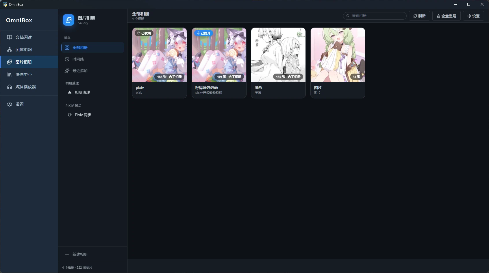

</div>

## 这是什么

OmniBox 是把散在本机各处的东西收进同一个窗口：图片相册、漫画书架、音乐与视频库、文档阅读器。

它本体只是一个窗口和插件容器，**能力全部来自插件**——内置 8 个插件随发行包提供，装上即用；无安装需求，插件放进 `plugins/` 就加载。

- **文件留在你自己机器上**：程序默认只监听 `127.0.0.1`，本身不需要任何账号；除你主动使用的在线功能（网易云音乐、Pixiv 同步、文档朗读的 edge-tts 端点、团体组网的公网 IPv6 文件共享）外，不向外部服务器发送数据。
- **免安装、可搬运**：Windows 与 Linux 都解压即用；配置、索引与缓存都在程序目录旁的 `.config/`、`data/` 里，整个目录拷走就是迁移。

## 内置插件

| 插件 | 能做什么 |
| --- | --- |
| **图片相册** `image-viewer` | 多个图片目录、按文件夹聚合的相册、混合瀑布流、时间线与幻灯片浏览 |
| **重复图片清理** `image-cleaner` | 挂在图片相册里：扫描全部相册中的重复 / 相似图片 |
| **Pixiv 同步** `pixiv-sync` | 挂在图片相册里：同步下载关注画师的新作与收藏画作 |
| **漫画中心** `manga-library` | 书架浏览、章节阅读、收藏与最近阅读，以及下载任务管理 |
| **媒体播放器** `media-player` | 音乐/视频专辑、最近播放、混编歌单、歌词沉浸页、EQ 与全屏播放 |
| **网易云音乐** `netease-music` | 挂在媒体播放器里：基于网易云官方cli的在线音乐播放接口 |
| **文档阅读** `document-reader` | 本地文档目录的读写与朗读 |
| **团体组网** `group-mesh` | 无中心团体组网：身份、团体名单、共享节点与加密传输 |

图片相册、漫画中心、媒体播放器、文档阅读、团体组网在左侧导航栏里各有入口；重复图片清理、Pixiv 同步、网易云音乐是 **Companion 插件**，没有独立导航项，入口挂在宿主插件内部——比如在图片相册里打开「相册清理」或「Pixiv 同步」，在媒体播放器里切到网易云音乐。

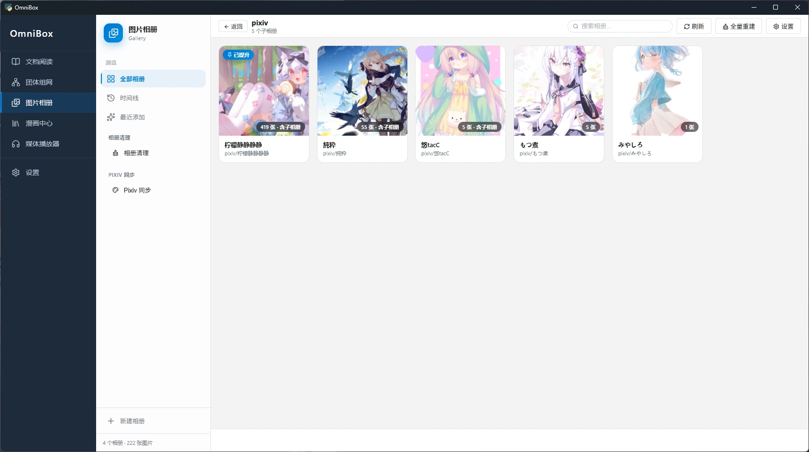

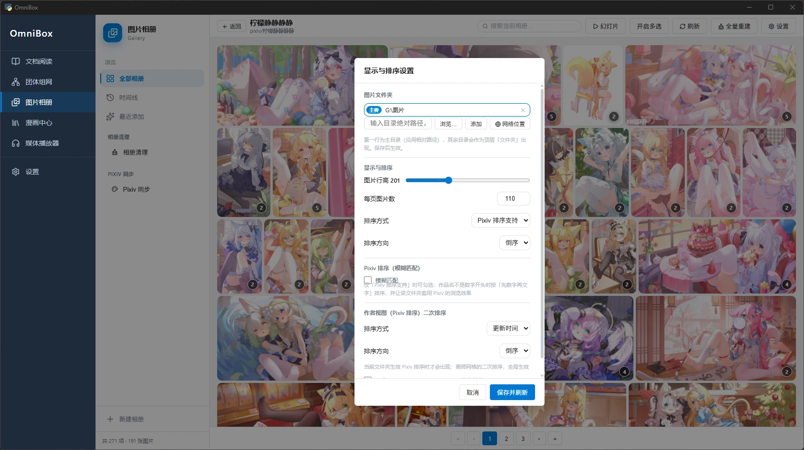

## 界面速览

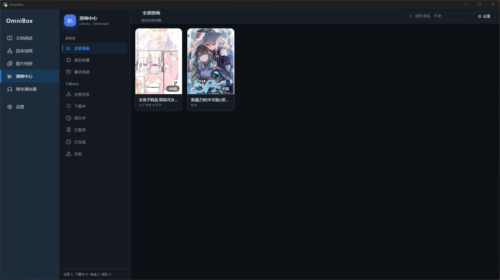

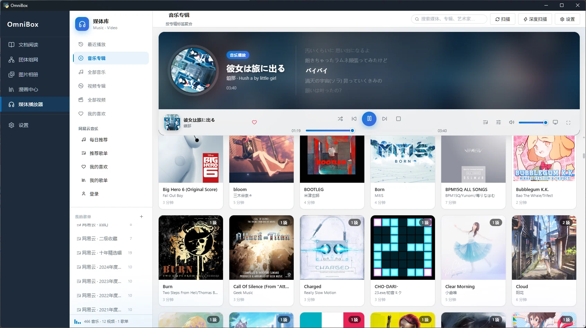

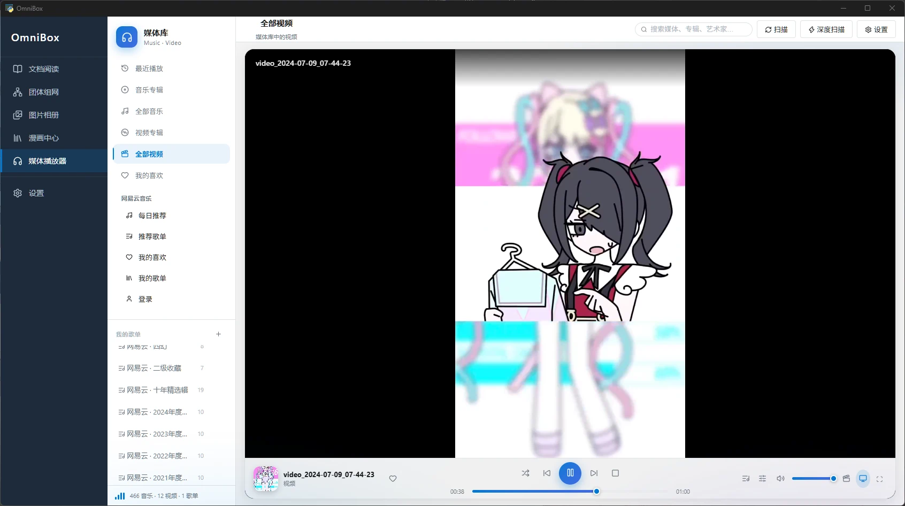

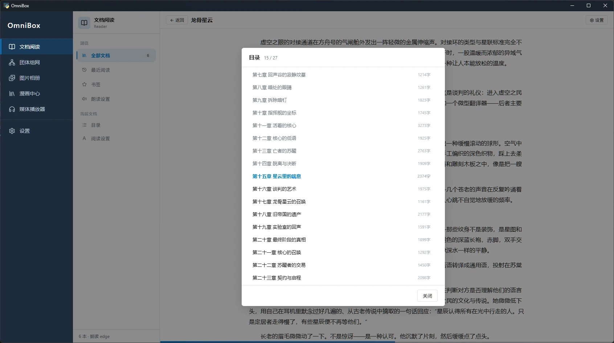

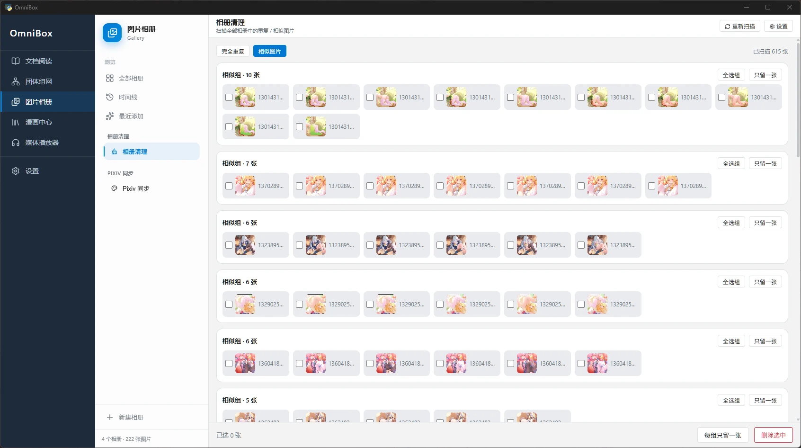

## 接上在线服务

两个 Companion 插件把在线内容接进本地库：**Pixiv 同步**把关注画师的新作与收藏画作下载进图片相册（按画师聚合成子相册，重复作品按 Pixiv 作品 ID 自动跳过）；**网易云音乐**在媒体播放器里提供每日推荐、推荐歌单与我的歌单。

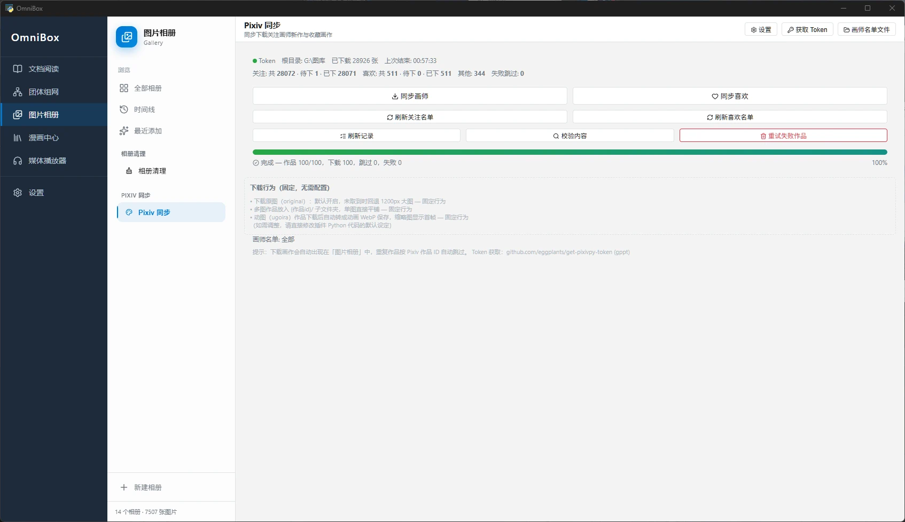

## 下载与安装

到 [Releases](https://github.com/Flotiarenor/OmniBox/releases/latest) 下载对应平台的压缩包：

| 平台 | 产物 | 启动方式 |
| --- | --- | --- |
| Windows x64 | `OmniBox-windows-x64.zip` | 解压后双击 `OmniBox.exe` |
| Linux x64 | `OmniBox-linux-x64.tar.gz` | `tar -xzf` 后 `chmod +x OmniBox && ./OmniBox` |

每次发布同时提供 `.sha256` 校验文件，可用于核对下载是否完整。

三步走：

1. 下载对应平台的压缩包；
2. **完整解压**到你有写权限的目录（例如 `D:\OmniBox`、`~/omnibox`）；
3. 运行可执行文件，浏览器/窗口里打开即用。

两个必须提前知道的事：

- 程序把配置、索引与缓存写在**自己所在的目录**（`.config/`、`data/`）。所以别在压缩包里直接双击运行，也**不要**把运行过的目录再打包发给别人——那会把你的配置和数据一起带走。
- 可执行文件未做代码签名，Windows 首次运行可能被 SmartScreen 拦下：点「更多信息」→「仍要运行」。

## 用浏览器访问（NAS / 服务器 / 局域网）

不想开桌面窗口时，可以只跑后端，用浏览器访问：

```bash
python main.py --web-only        # 默认 http://127.0.0.1:18080
```

`/api`、`/file`、`/thumbs` 等数据路由受访问令牌保护：令牌在首次启动时生成并写入 `.config/auth_token.txt`（重启不变），浏览器页面会自动种下 HttpOnly Cookie，外部脚本调用时带上请求头即可：

```bash
curl -H "X-Omnibox-Token: $(cat .config/auth_token.txt)" \
     -X POST http://127.0.0.1:18080/api/system_get_config
```

> 需要公网访问时，请经 nginx 之类的反向代理自行加一层 HTTPS 与访问控制；不要把令牌文件和端口直接暴露到不受信任的网络。

## 安装与卸载插件

1. 把插件文件夹放进程序旁的 `plugins/` 目录（从源码运行时是项目根目录的 `plugins/`）；
2. 重启应用，插件出现在导航栏里；
3. 删除文件夹重启即卸载插件

插件可以自带纯 Python 依赖（放在其 `backend/libs`），不装进主环境，删除目录即卸载干净。插件开发请看[插件开发指南](./docs/plugin-guide.md)。

## 常见问题

**需要联网吗？**
相册、漫画、媒体库、文档阅读都是纯本地功能，断网可用。联网只发生在你主动使用在线功能时：网易云音乐与 Pixiv 同步访问各自的在线服务，文档朗读把待读文本发往 edge-tts 语音端点等。

**我的数据存在哪里？怎么备份或迁移？**
配置在 `.config/`、索引与缓存在 `data/`，都在程序目录旁边。整个目录拷走即可迁移；`.config/` 内含本机访问令牌，分享给别人前先删掉。

**会改动我的原始文件吗？**
相册、漫画库、媒体库都只是按目录建立索引，不改动原文件；程序产生的索引与缩略图缓存在 `data/` 下，可在「设置 → 数据与缓存」里查看占用并清空。

**支持 macOS 或手机吗？**
目前只发布 Windows 与 Linux 产物。Web 模式可以用手机浏览器打开，但界面是按桌面尺寸设计的。

**界面能改成什么样？**
「设置 → 外观」提供浅色/深色、界面圆角、导航栏宽度、动效开关，以及 13 项 CSS 变量级颜色自定义；改动会自动同步到所有插件页面。

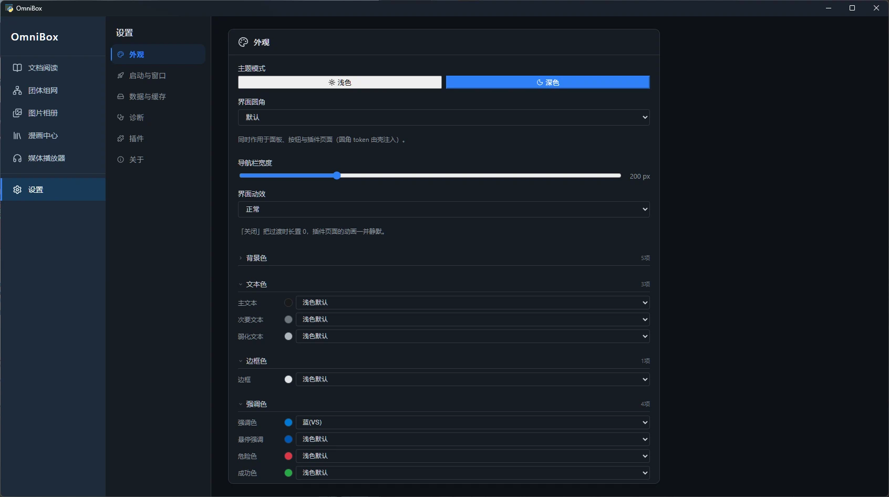

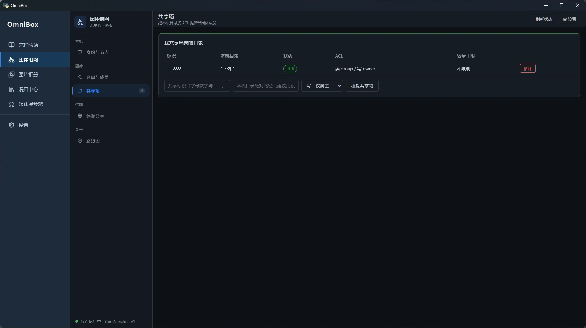

**为什么功能都拆成插件？**
主程序只负责窗口、导航、插件加载与文件服务的路径安全，业务能力全部下沉到插件：插件与主程序独立开发、独立构建，前端技术栈自由（Vue、React 或纯 HTML 都行），单个插件损坏也不会拖垮主程序。

## 开发者

- [开发文档](./docs/development.md)：架构概览、从源码运行、调试、打包发布与 CI 门禁
- [插件开发指南](./docs/plugin-guide.md) / [插件界面指南](./docs/plugin-ui-guide.md)
- 一键生成插件骨架：`python tools/new_plugin.py my-tool`

## 许可证与反馈

本项目基于 **Apache License 2.0** 开源，详见 [LICENSE](./LICENSE)。

问题与建议请提 [Issue](https://github.com/Flotiarenor/OmniBox/issues)，欢迎 PR。
